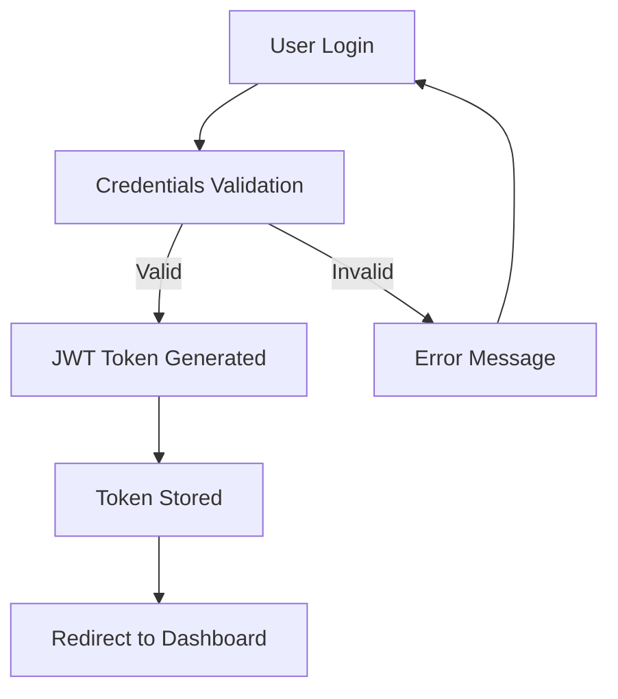

# Digital Market Place - Next.js

A modern, full-featured digital marketplace built with Next.js 15, TypeScript, and Tailwind CSS. This project demonstrates enterprise-grade architecture patterns and best practices for scalable web applications.

## Quick Start

```bash
# Clone and install
git clone <repository-url>
cd Next/web
npm install

# Start development server
npm run dev

# Open in browser
# http://localhost:3000
```

## Documentation

### Core Documentation
- [Project Structure](./docs/PROJECT_STRUCTURE.md) - Architectural overview and directory organization
- [Development Guide](./docs/DEVELOPMENT_GUIDE.md) - Development workflow, patterns, and best practices
- [Svelte vs Next.js Comparison](./docs/COMPARISON_WITH_SVELTE.md) - Comparison between implementations
- [Future Development](./docs/FUTURE_DEVELOPMENT.md) - Roadmap and strategic direction

### Project Features

#### Current Features
- Authentication System - Login, registration, password recovery
- Responsive Design - Mobile-first, modern UI with Tailwind CSS
- Component Library - shadcn/ui based design system
- Dashboard - Product management and analytics
- Search & Navigation - Intuitive sidebar and content organization
- Performance Optimized - Next.js 15 with App Router
- Type Safety - Comprehensive TypeScript implementation

#### Planned Features
- Real-time notifications
- Advanced analytics dashboard
- Multi-tenant support
- PWA capabilities
- AI-powered recommendations

## Architecture Overview

### Technology Stack
```typescript
// Frontend
Next.js 15        // React framework with App Router
TypeScript        // Type safety and developer experience
Tailwind CSS      // Utility-first styling
shadcn/ui         // Component library
React Query       // Server state management

// Development
ESLint            // Code linting
Prettier          // Code formatting
Jest              // Testing framework
```

### Project Structure
```
src/
├── app/                    # Next.js App Router
│   ├── (app)/             # Protected application routes
│   │   ├── _components/   # App-specific components
│   │   ├── home/          # Dashboard home
│   │   ├── products/      # Product management
│   │   ├── store/         # Store configuration
│   │   └── settings/      # User settings
│   └── (auth)/            # Authentication routes
├── components/            # Reusable UI components
│   ├── ui/               # Base components (shadcn/ui)
│   ├── auth/             # Authentication forms
│   └── header/           # Navigation components
└── lib/                  # Utilities and configuration
    ├── api/              # API utilities
    ├── hooks/            # Custom React hooks
    ├── auth/             # Authentication logic
    └── providers/        # Context providers
```

## Development Commands

```bash
# Development
npm run dev              # Start development server
npm run dev:debug        # Start with debugging enabled

# Building
npm run build           # Production build
npm run start           # Start production server
npm run analyze         # Bundle size analysis

# Code Quality
npm run lint            # Run ESLint
npm run lint:fix        # Fix ESLint issues
npm run type-check      # TypeScript checking
npm run format          # Prettier formatting

# Testing
npm run test            # Run tests
npm run test:watch      # Watch mode
npm run test:coverage   # Coverage report
```

## Design System

### Component Examples
```tsx
// Button variants
<Button variant="default">Primary Action</Button>
<Button variant="secondary">Secondary Action</Button>
<Button variant="destructive">Delete Action</Button>

// Form components
<Input placeholder="Enter email" type="email" />
<Select>
  <SelectItem value="option1">Option 1</SelectItem>
</Select>

// Layout components
<Card>
  <CardHeader>
    <CardTitle>Card Title</CardTitle>
  </CardHeader>
  <CardContent>Card content...</CardContent>
</Card>
```

### Styling Patterns
```tsx
// Conditional classes with cn() utility
const buttonClass = cn(
  'base-button-styles',
  variant === 'primary' && 'bg-blue-600 text-white',
  disabled && 'opacity-50 cursor-not-allowed'
)

// Responsive design
<div className="grid grid-cols-1 md:grid-cols-2 lg:grid-cols-3 gap-4">
  {/* Content */}
</div>
```

## Authentication Flow



### Route Protection
```tsx
// Protected routes automatically redirect unauthenticated users
app/(app)/       // Requires authentication
app/(auth)/      // Public authentication pages
```

## Performance Metrics

### Current Scores
- **Lighthouse Performance**: 95+
- **First Contentful Paint**: <1.5s
- **Largest Contentful Paint**: <2.5s
- **Bundle Size**: ~180KB gzipped

### Optimization Features
- Automatic Code Splitting: Route-level splitting
- Image Optimization: Next.js Image component
- Font Optimization: Next.js Font optimization
- CSS Optimization: Tailwind CSS purging

## Deployment

### Vercel (Recommended)
```bash
# Install Vercel CLI
npm i -g vercel

# Deploy
vercel

# Production deployment
vercel --prod
```

### Docker
```dockerfile
# Dockerfile included for containerized deployment
docker build -t digital-marketplace .
docker run -p 3000:3000 digital-marketplace
```

### Environment Variables
```env
# Required environment variables
NEXT_PUBLIC_API_URL=your_api_url
DATABASE_URL=your_database_url
NEXTAUTH_SECRET=your_secret_key
```

## Testing Strategy

### Test Coverage
- **Unit Tests**: Component testing with Jest + RTL
- **Integration Tests**: API route testing
- **E2E Tests**: Critical user flows with Playwright
- **Visual Testing**: Component story testing

### Example Tests
```tsx
// Component test
describe('AppSidebar', () => {
  it('renders navigation links', () => {
    render(<AppSidebar />)
    expect(screen.getByText('Home')).toBeInTheDocument()
  })
})

// API test
describe('Products API', () => {
  it('creates product successfully', async () => {
    const response = await POST('/api/products', productData)
    expect(response.status).toBe(201)
  })
})
```

## Comparison with Svelte Version

| Feature | Next.js | Svelte |
|---------|---------|--------|
| **Bundle Size** | 180KB | 120KB |
| **Runtime** | React Virtual DOM | Compiled, No Runtime |
| **Learning Curve** | Moderate (React knowledge) | Easier (simpler syntax) |
| **Ecosystem** | Extensive React ecosystem | Growing ecosystem |
| **Performance** | Excellent with optimizations | Excellent by default |

When to choose Next.js:
- Existing React team expertise
- Need for extensive third-party libraries
- Enterprise-scale requirements
- Rich tooling and debugging

## Contributing

### Development Workflow
1. Fork the repository
2. Create feature branch: `git checkout -b feature/amazing-feature`
3. Make changes and test thoroughly
4. Commit with conventional commits: `git commit -m "feat: add amazing feature"`
5. Push and create Pull Request

### Code Standards
- TypeScript: Strict mode enabled
- ESLint: Extended configuration with React hooks rules
- Prettier: Consistent code formatting
- Conventional Commits: Standardized commit messages

## Support & Resources

### Getting Help
- **Documentation**: Check the `/docs` folder
- **Issues**: Create GitHub issues for bugs
- **Discussions**: Use GitHub discussions for questions

### Useful Links
- [Next.js Documentation](https://nextjs.org/docs)
- [TypeScript Handbook](https://www.typescriptlang.org/docs/)
- [Tailwind CSS Docs](https://tailwindcss.com/docs)
- [shadcn/ui Components](https://ui.shadcn.com/)

## License

This project is licensed under the MIT License - see the [LICENSE](LICENSE) file for details.

---

Built using Next.js, TypeScript, and modern web technologies.
